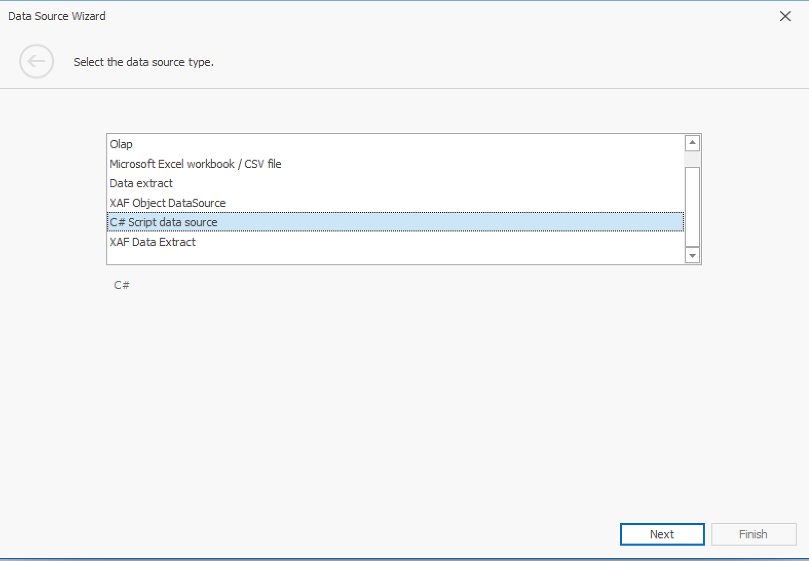
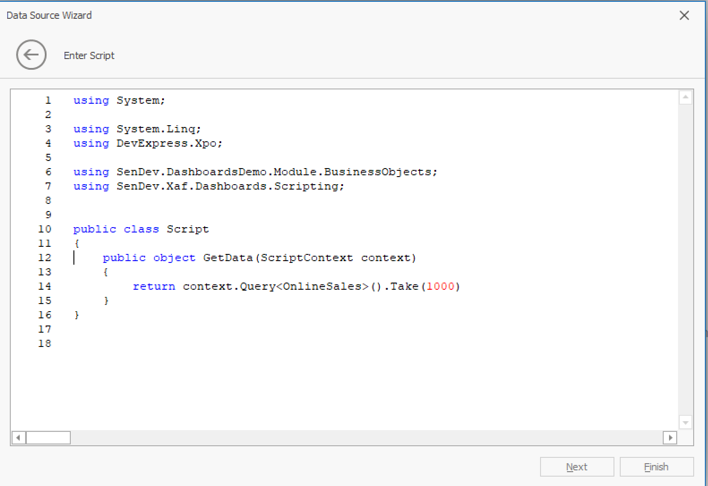
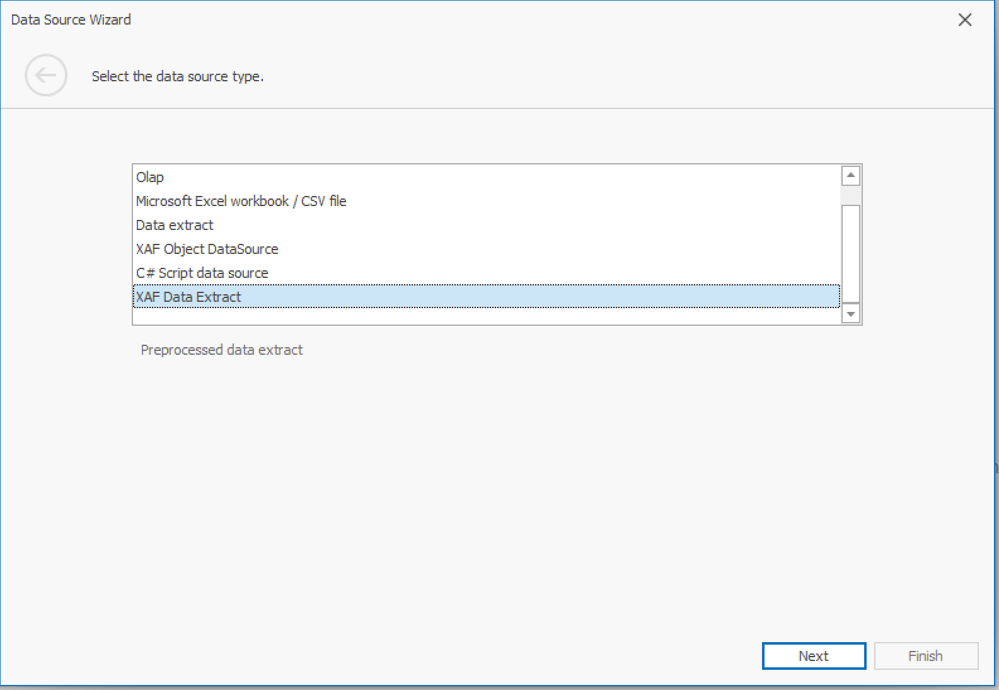

# SenDev XAF Dashboards
[](https://dev.azure.com/SenDevGmbH/XafDashboards/_build/latest?definitionId=1&branchName=master)

## Introduction
This module adds to the DevExpress XAF Dashboards module 2 new data sources:
 * C# Script Data Source
 * XAF Data Extract Data Source

### C# Script Data Source
C# Script data source allows to specify dashboard data source with C# Scripts at runtime.

### XAF Data Extract Data Source
XAF Dashboards provides with [Data Extracts](https://documentation.devexpress.com/Dashboard/115900/Creating-Dashboards/Creating-Dashboards-in-the-WinForms-Designer/Providing-Data/Extract-Data-Source) a feature that allows You to store dashboard data in an optimized format for data grouping and other dashboard operations. With data extract large amounts of data can be stored in a compact format and be quickly loaded into dashboards. For example queries with large amounts of data can execute and create data extract nightly. Prepared data extracts can then be quickly loaded into the dashboards. 

XAF Data Extract Data Source has following features:
 * Memory-optimized creation of data extracts for large datasets. 
 * Storing data extracts in the database
 * Specify Data Source with C# scripts


## Getting started
### Installing SenDev.XafDashboard packages into your application modules
We Nuget packages for multiple DevExpress versions. You can pick the matching version for Your installed DevExpress Suite by specifying a range of versions `-MinimumVersion` and `-MaximumVersion` options of the Install-Package command.

#### Platform agnostic module
Install the package with following command in the Visual Studio Package Manager Console 
```Console
Install-Package SenDev.Xaf.Dashboards -MinimumVersion 18.2.6 -MaximumVersion 18.2.6.65535
```

Add following line in the InitializeComponent method in Module.Designer.cs:
```C#
this.RequiredModuleTypes.Add(typeof(Xaf.Dashboards.SenDevDashboardsModule));
```

#### Windows module
Install the package with following command in the Visual Studio Package Manager Console 
```Console
Install-Package SenDev.Xaf.Dashboards.Win -MinimumVersion 18.2.6 -MaximumVersion 18.2.6.65535
```

Add following line in the InitializeComponent method in WinModule.Designer.cs:
```C#
this.RequiredModuleTypes.Add(typeof(Xaf.Dashboards.Win.SenDevDashboardsWinModule));

```

#### Web module
Install the package with following command in the Visual Studio Package Manager Console 
```Console
Install-Package SenDev.Xaf.Dashboards.Web -MinimumVersion 18.2.6 -MaximumVersion 18.2.6.65535
```

Add following line in the InitializeComponent method in WebModule.Designer.cs:
```C#
this.RequiredModuleTypes.Add(typeof(DevExpress.ExpressApp.Dashboards.Web.DashboardsAspNetModule));
```

### Using Script Data Source
Start Application. Goto Dashboards and click on "New". Select "C# Script Data Source":


Click Next and specify the script:


You can use following script template:

```C#
using System;

using System.Linq;
using DevExpress.Xpo;	

using SenDev.DashboardsDemo.Module.BusinessObjects;
using SenDev.Xaf.Dashboards.Scripting;		


public class Script
{
    public object GetData(ScriptContext context)
    {
        return context.Query<OnlineSales>().Take(1000);
    }
}
```

### Using XAF Data Extract Data Source

First, we must create a data extract. Goto _Dashboard Data Extract_ Navigation Item. Click On "New". Enter a data extract name and the script. You can use the same template as for the Script Data Source above. Then Click on _Save & Close_. In the list view use the "Update Data" button to create data extract: 


After the data extract is created, we can use it in a dashboard. Goto dashboards, click on new. 
In the data source window select "XAF Data Extract":


On the next page You can select the data extract, You created previously:


Then click on "Finish". Your Data Extract Data Source is ready!

#### Scheduling Updates of Data Extracts
We are not providing are build-in job scheduler with the packages. However the demo application implements a scheduler by using [Hangfire](https://www.hangfire.io), You can use the code in Your applications.

Also You can easily integrate You preferred scheduler by implementing the `IJobScheduler` interface.


## Development

### Pre-requisites
* Visual Studio 2017
* Microsoft SQL Server 2017 or higher
* DevExpress Universal Suite 18.2

### Database
Download the [Contoso BI Demo DataSet](https://www.microsoft.com/en-us/download/details.aspx?id=18279). Restore the database, use ContosoRetailDW for database name. 
Connection Strings in the applications are configured to use default instance of the SQL Server, if You're not using the default instance, You can modify the Connection Strings accordingly.
After opening the SenDev.Xaf.Dashboards.sln in Visual Studio, go to the solution properties and set the SenDev.Xaf.Dashboards.Win and SenDev.Xaf.Dashboards.Web projects to "Start":
.

The web application needs allways to be started, since it hosting a WCF Service for job scheduler.

